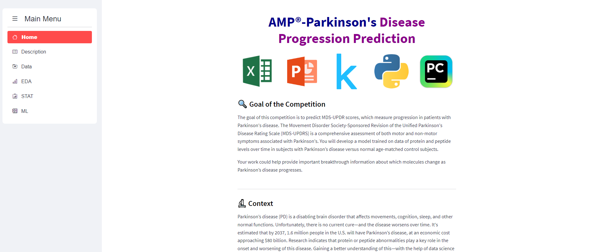
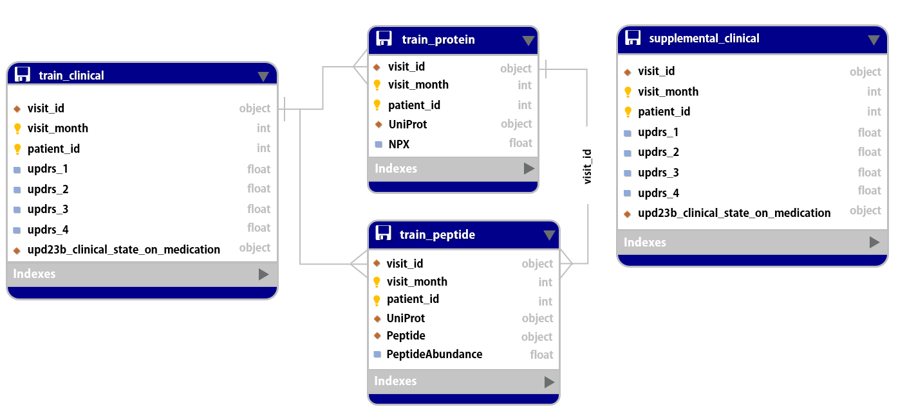

# Parkinson Project (2023.04.24 ~ 2023.05.17)

[대시보드 링크](https://bigdata210-kaggle-app-31uh7i.streamlit.app/)   
[발표 영상]   
[데모 시연]   
[포트폴리오](https://github.com/bigdata210/Kaggle/blob/ec1613296b5a62eb5a265012b2730cf5c5153766/pdf/2%EC%A1%B0_%ED%8C%8C%ED%82%A8%EC%8A%A8_%EC%A7%88%EB%B3%91_%EC%A7%84%EB%8B%A8%EC%98%88%EC%B8%A1.pdf)  

## 목적
파킨슨병 환자의 임상 데이터를 사용하여, 파킨슨병 환자의 진행을 측정하는 MDS-UPDRS(통합 파킨슨병 평가척도) 예측

## 데이터
캐글의 AMP - Parkinson's Disease Progression Prediction 주제의 데이터를 사용
( train_clinical_data.csv, supplemental_clinical_data.csv, train_peptides.csv, train_protein.csv)

## ERD

## 팀 구성
- 사용언어 : Python 3.9.13v
- 작업 툴 : google colab, pycharm, kaggle
- 인원 : 6명
- 주요 업무 : Streamlit 라이브러리를 이용한 웹개발 구현 코드 작성 및 머신러닝을 활용한 파킨슨 질병 진단 예측
- 기간 : 2023-04-27 ~ 2023-05-16 

## 주요 기능
- ***홈페이지(Home)***
  + 대회목표 및 대회 개요
  
- ***설명(Description)***
  + 파킨슨병 / MDS-UPDRS 점수 설명
  + 평가지표 설명
  + 대회에 사용되는 용어 설명
  
- ***데이터(Data)***
  + 데이터셋 컬럼 확인
  + 데이터셋 확인
  
- ***탐색적자료분석(EDA)***
  + UPDRS 점수와 약물복용여부 그래프
  + Null값 분석 및 비교
  + clinical 데이터, supplemental 데이터 분포 확인
  + protein 데이터, peptide 데이터 분포 확인
  + protein 변동계수에 따른 상관관계
  + peptide 변동계수에 다른 상관관계 
  
- ***통계(Stat)*** 
  + 기초통계분석
  + 상관분석
  + 평가지표
  
- ***모델링(ML)***
  + Catboost 설명
  + 교차검증
  + 모델 구축
  + 모델 성능 평가
